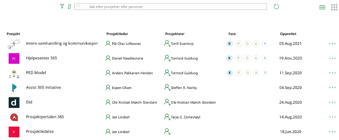
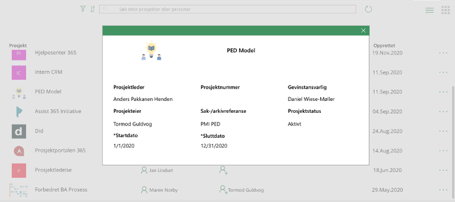
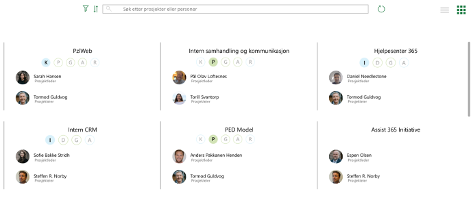

## 2. Tabellvisninger
Listevisningen er standard i appen, men det finnes to figurer oppe i høyre hjørne hvor man kan bytte mellom liste- og kortvsining.

### 2.1 Listevisning
Listevisningen viser følgende informasjon om hvert prosjekt:
* Prosjektnavn
* Prosjektleder
* Prosjekteier
* Hvilken fase prosjektet er i
* Dato for opprettelse

##### 2.1.1 Prosjektdetaljer
Ved å trykke på de tre prikkene på høyere side av hvert prosjekt, vil brukeren kunne se litt mer informasjon om prosjektet uten å måtte navigere bort fra forsiden. 

### 2.2 Kortvisning
Kortvisningen inneholder følgende data om hvert prosjekt:

* Prosjektnavn
* Hvilken fase 
* Prosjektleder
* Prosjekteier

