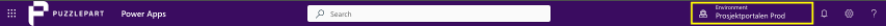
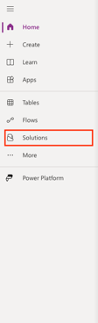
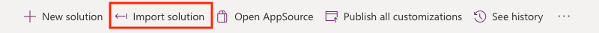
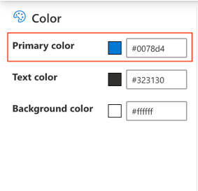
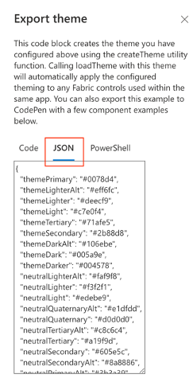

## 2. Importer løsningen
Åpne nettleseren din og gå til *[make.powerapps.com](https://make.powerapps.com)*, og velg det miljøet du ønsker å installere løsningen oppe i høyre hjørne:

Når riktig miljø er valgt, så trykker du på **Løsninger** på venstre side:

Trykk på **Importer løsning** i kommandobaren på toppen:

Deretter vises en pop-up vindu på høyre side. Her lastes opp zip-filen som du hentet fra App Source.

### 2.1 Miljøvariabler
For at applikasjonen skal bli satt opp riktig finnes det ulike miljøvariabler som må fylles ut:
* SharePoint Projects Site
* SharePoint Projects List
* Projects Site URL
* Theme (JSON)

##### 2.1.1 SharePoint Projects Site og List
Velg området i SharePoint applikasjonen skal knyttes opp, deretter velger du listen kalt «Prosjekter».

##### 2.1.2 Projects Site URL
Lim inn URL til området til Prosjektportalen.

##### 2.1.3 Theme (JSON)
Denne miljøvariabelen avgjør fargetemaet for appen. *[Trykk her](https://fluentuipr.z22.web.core.windows.net/heads/master/theming-designer/index.html)* og legg til ønskelige farger på venstre side av nettsiden. Vi anbefaler at tekst og bakgrunnsfargen forblir svart og hvit, og kun velge en primærfarge.

Deretter trykker du på den blå knappen som heter «Export theme». Da vil dette vinduet vises på høyre side av skjermen:

Trykk på den midterste faenen «JSON», kopier koden i vinduet og lim den inn i miljøvariabelen.